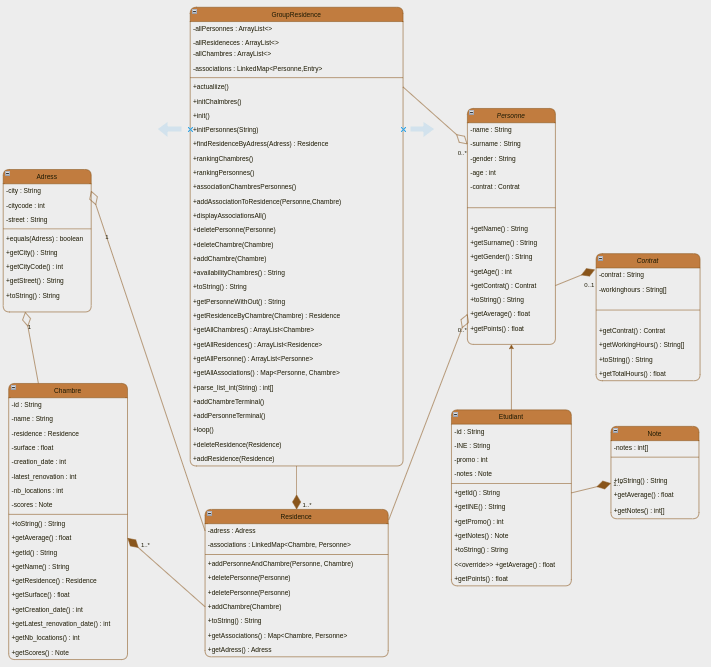
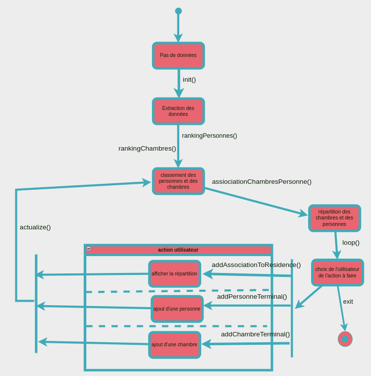

### Alan DELY
## La (fausse) loterie des chambres

Ce projet a pour but de répartir des chambres à des personnes. 
Ces personnes peuvent être des étudiants ou des personnes qui travaillent 
seulement. J'ai choisi de modéliser un groupement de résidences qui rassemble
plusieurs résidences. Ce groupement stocke toutes les chambres et toutes les
demandes des personnes voulant les chambres. 

## Lancement sur Linux

### Déziper le projet
```bash
unzip LoterieChambres.zip
```
### Se placer dans le dossier
```bash
cd LoterieChambres/
```
### Compilage
```bash
javac *.java
```
### Lancer Projet 
#### Avec des arguments
```bash
java GroupResidence "Ressources/liste_chambres.csv" "Ressources/liste_etudiants.csv"
```
#### Sans arguments
```bash
java GroupResidence
```
### Lancement des tests
```bash
java Main
```

## Démarche
Dans une première partie, j'ai modélisé mon projet en UML sous forme de diagramme
de classe. Cela m'a permis de directement voir les classes importantes. J'ai pu 
aussi mieux appréhender les structures d'objets à utiliser pour le stockage des objets.


### Diagramme de classe en UML
<div style="display: flex;margin: 2em 0 3em 0">
  
</div>

Ce diagramme de classe est final, je l'ai modifié au cours de mon implémentation
à cause de différents problèmes. Notamment pour les personnes, j'ai rajouté une
classe Contrat pour diminuer la taille de la classe Personne. 

Au cours de mon implémentation, j'ai commencé à modéliser un diagramme d'états-transitions
pour le système complet. Cela m'a permis de comprendre les actions que je réalisais. 
J'ai pu aussi mieux me poser la question pour faire une mini-interface utilisateur en console
afin de pouvoir choisir son action : afficher la répartition des chambres, ajouter une personne,
ajouter une chambre ou quitter le programme. J'ai aussi pour les entrées utilisateurs mis des sécurités pou ne pas avoir d'erreurs
pour ne pas causer d'importantes erreurs. 
### Diagramme d'états-transitions en UML

<div style="display: flex;margin : 2em 0 5em 0">
  
</div>


## Les Tests

Pour les tests, j'ai modélisé une classe MainTest. Pour chaque classe de mon projet j'ai 
créé une classe de test associée. Ces classes de test se situent dans le fichier MainTest.java et 
instancient des objets de la classe qui est leur associée. Par exemple la classe de test
ResidenceTest va créé un objet Residence et vérifier avec l'instruction assert si le 
résultat de la méthode testée est en acccord avec ce qu'on attend. Si j'avais eu plus de 
temps j'aurais changé mon implentation pour le stockage de mes associations en passant
par une structure qui trie directement en fonction d'une méthode les associations. 


